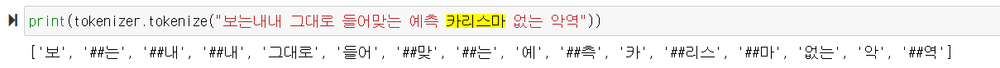
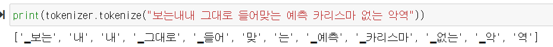
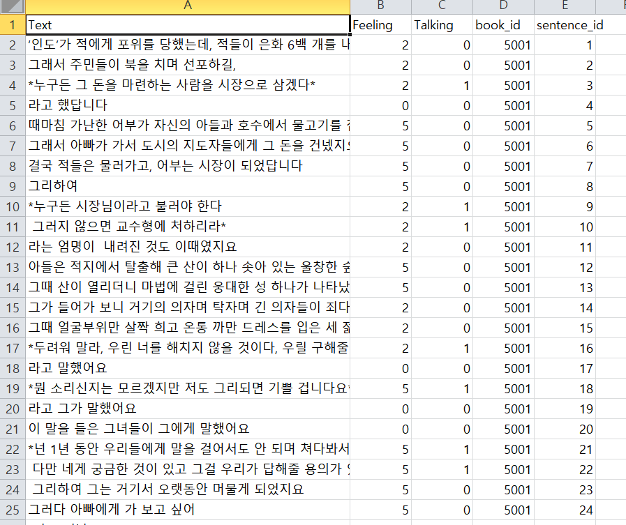
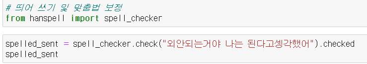

# 자연어 처리

### RNN, LSTM, GRU 사용

https://wikidocs.net/24586

- 자연어 처리 관련 블로그(전처리부터 모델까지 전부 잘 정리되어있는 블로그)

### BERT

https://www.youtube.com/watch?v=qlxrXX5uBoU&ab_channel=SKplanetTacademy

- SKplanet Tacademy, 솔트록스에서 BERT관련 강의1~5강
- Bert를 활용한 챗봇관련된 내용도 있습니다.

### KOBERT

https://www.youtube.com/watch?v=OOfCI8R0jr8&t=815s&ab_channel=%EA%B9%80%EC%9B%85%EA%B3%A4

- Bert, KOBERT 코드 구현 설명 유튜브 

https://github.com/kimwoonggon/publicservant_AI

- 위 유튜브 관련 코드 깃허브 

### 실제로 구현한 방식

- KOBERT + 다중분류 
  - KOBERT가 결과값이 더 좋다고 하여서

Bert 토크나이징

KOBERT 토크나이징

-> 토크나이징이 더 잘되는 것을 볼 수 있음

#### HuggingFace 

HuggingFace는 자연어 처리 인공지능 모델에서, BERT 모델 같은 트랜스포머 모델들을 쉽게 다룰 수 있게 해주는 패키지

RNN,LSTM,GRU -> 52퍼센트의 결과 

KOBERT -> 49퍼센트의 결과 

- Bert모델에 대해서 더 보아야 하겠지만, 결과를 좀더 봐야할 부분

# 프로젝트 현재 상황 및 이슈

- 전처리 13000건 감정 분류 

  - Feeling
    - 0 의미없음, 1. 기쁨/평화 2. 긴장/속임수/놀람 3. 최고조/분노 4. 슬픔 5. 위로/잔잔
  - Talking 
    - 0 평서문 1 대화문 
  - Book_id 
    - 책 하나당 id 부여 
  - Sentence_id 
    - 책 하나에서의 문장 순서

  각 문장에 대해서 개별적인 감정 분류가 아닌 앞뒤 문맥을 기반으로한 감정 라벨링 실시

- LSTM/GRU/RNN 데이터의 신경망을 변화하여도 모델정확도 향상에 큰 영향을 미치지 않음 
- 불용어를 리스트 정비 / Padding Size 증감 / 사용빈도적은 단어 정제(3회 미만 단어 전체의 10퍼센트 정도)를 변수로 두었을 때도 모델 정확도 향상에 큰 영향을 미치지 않음

- 뛰어쓰기 및 맞춤법 정제를 하여도 모델 정확도 향상에 큰 영향을 미치지 않음

- 현재 모든 모델에서 들어가는 데이터 열은 Text와 Feeling뿐입니다. 
- 감정 라벨링은 앞뒤 문맥을 기반으로 감정 분석을 실시했지만, 현재 딥러닝 모델같은 경우는 문장하나하나를 별개로 두고 학습했기 때문에 좋은 결과값이 나오지 않고 있음.
  - sentence_id 같은 변수를 넣어야 더 좋은 결과가 나올 수 있을것이라고 생각하는데, 이 부분 관련 **모델 구축에 어려움**을 겪고있음 (머신러닝같이 변수열 추가 이런것이 쉽지 않음)
  - bert의 segment embedding에 문장순서라는 변수를 집어넣을 수 있는지(확인해 봐야함)

### 현재 서비스 계획

- 텍스트파일을 넣으면 문장단위로 감정분석 결과가 나오고 결과값 노이즈 제거 후 bgm이 나오게 할 예정 

정확한 토의는 팀에서 목요일에 할거 같아요

### 맞춤법 정제 관련 모듈 

https://wikidocs.net/92961

